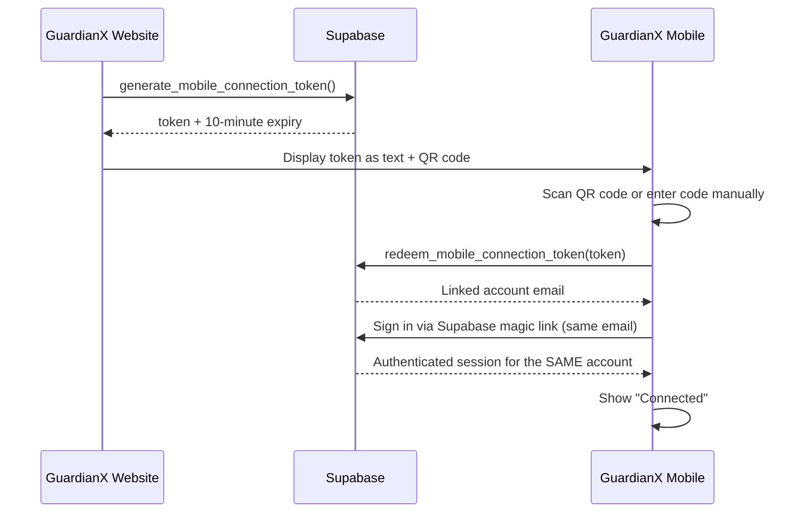
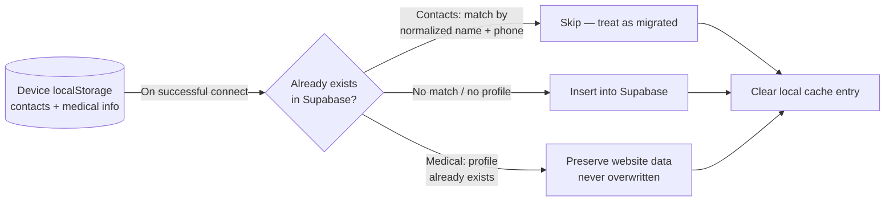
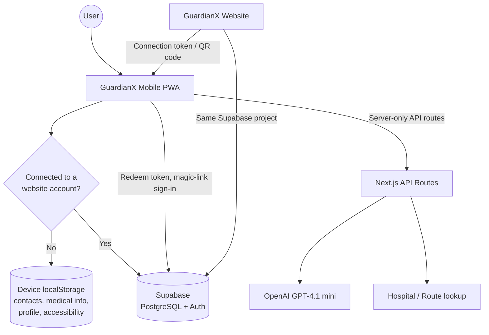

# GuardianX Mobile

> The companion mobile Progressive Web App (PWA) of the **GuardianX** ecosystem — fast, mobile-first access to emergency assistance, family contacts, and medical information.

<div align="center">

| 🌐 Production | 📦 Repository |
|:---:|:---:|
| [guardianx-mobile.vercel.app](https://guardianx-mobile.vercel.app) | [github.com/dawoodnadeem9914/guardianx-mobile](https://github.com/dawoodnadeem9914/guardianx-mobile) |

**Companion App:** [GuardianX Website](https://guardianx-beta.vercel.app) · [Repository](https://github.com/dawoodnadeem9914/guardianx)

</div>

---

## Table of Contents

1. [Project Overview](#project-overview)
2. [Why GuardianX Mobile?](#why-guardianx-mobile)
3. [UCRIX 2026 Project](#ucrix-2026-project)
4. [Role of the Mobile Application](#role-of-the-mobile-application)
5. [Feature Status Legend](#feature-status-legend)
6. [Key Features](#key-features)
7. [Website Account Connection Flow](#website-account-connection-flow)
8. [Data Synchronization](#data-synchronization)
9. [Local Storage](#local-storage)
10. [Supabase Integration](#supabase-integration)
11. [Authentication / Account Linking](#authentication--account-linking)
12. [Technology Stack](#technology-stack)
13. [Architecture](#architecture)
14. [Project Structure](#project-structure)
15. [Environment Variables](#environment-variables)
16. [Local Development](#local-development)
17. [Deployment](#deployment)
18. [Testing / Verification](#testing--verification)
19. [Security](#security)
20. [Medical & Safety Disclaimer](#medical--safety-disclaimer)
21. [Project Status](#project-status)
22. [Related Repository — GuardianX Website](#related-repository--guardianx-website)
23. [Contributing](#contributing)
24. [License](#license)

---

## Project Overview

GuardianX Mobile is a lightweight, installable web app built for one purpose: getting a person to emergency help, their family contacts, and their own medical information in as few taps as possible. It complements the **GuardianX Website** — the full account, dashboard, and administration platform — by offering a fast, mobile-first entry point into the same ecosystem.

The app is usable immediately, with no account required, using on-device local storage for emergency contacts and medical information. It can optionally be connected to an existing GuardianX Website account, at which point that same data is synchronized into the shared Supabase backend and becomes consistent across both applications.

## Why GuardianX Mobile?

| Problem | GuardianX Mobile's Response |
|---|---|
| Medical information may not be accessible quickly during an emergency | A compact, always-on-device medical information form, usable with no account |
| Emergency contacts are often scattered across a phone's native contacts app | A single, prioritized list of up to 3 emergency contacts, one tap away |
| A full website dashboard is not built for someone in distress | A minimal, mobile-first interface with large touch targets and instant accessibility settings |
| The same person's data shouldn't have to be entered twice | Secure connection to an existing GuardianX Website account, with automatic data migration |

GuardianX Mobile is a **companion** to the website, not a replacement for it — deeper account management, detailed records, reports, and administration remain on the website.

## UCRIX 2026 Project

GuardianX is developed as an innovation project for the **UPM Computer Science Research & International Innovation Exhibition (UCRIX) 2026**, at Universiti Putra Malaysia (UPM), Faculty of Computer Science and Information Technology. GuardianX Mobile is the mobile component of that larger project.

| Milestone | Date |
|:---|:---|
| Submission | 27 July – 14 August 2026 |
| Judging Session | 17 – 21 August 2026 |
| Winners Announcement | 24 August 2026 |

UCRIX places particular emphasis on innovation projects that work toward the United Nations' 17 Sustainable Development Goals. GuardianX Mobile supports that direction by making emergency and health-related information reachable on the device most people already carry, without requiring an app-store install or a lengthy account setup before any help can be offered.

> *No award, ranking, or selection result is claimed here; this section describes the project's context, not its outcome.*

---

## Role of the Mobile Application

| Capability | GuardianX Website | GuardianX Mobile |
|:---|:---:|:---:|
| Account registration / login | ✅ Full | — (connects to existing account) |
| Medical profile | ✅ Full detail | ✅ Simplified fields, synced |
| Emergency contacts | ✅ Full management | ✅ Up to 3, synced |
| Family invitations & permissions | ✅ | — |
| AI emergency classification | ✅ | ✅ |
| AI conversational guidance | ✅ Full assistant | ✅ Guidance only |
| Institutional dashboards / reports | ✅ | — |
| Offline / no-account emergency access | — | ✅ |
| Camera-based QR account connection | — | ✅ |

---

## Feature Status Legend

This README distinguishes three states throughout, matching how the source code itself labels functionality:

| Symbol | Meaning |
|:---:|:---|
| ✅ **Implemented** | Real, working functionality — verified in source code |
| ⚙️ **Optional / Configuration-Dependent** | Real integration that requires an API key or a connected website account; degrades to an honest "unavailable" or "local-only" state when unconfigured |
| 🧪 **Simulated** | Deliberately implemented as a simulation, clearly labeled in the source code, not a live third-party integration |

---

## Key Features

### Emergency Access ✅ / 🧪

- An Emergency Help flow supporting voice, text, and camera/image input.
- Real AI-based emergency classification (medical / police / fire / unclear) and real, context-aware AI guidance via GPT-4.1 mini ⚙️, with an honest, clearly labeled non-AI fallback classifier when the AI service is unavailable — never silently presented as AI-generated.
- Real `tel:999` calling.
- Real geolocation and a real straight-line distance calculation to the nearest hospital; travel time is explicitly labeled as an estimate, not live traffic/routing data.
- A simulated ambulance/hospital journey shown only for Medical emergencies 🧪, clearly labeled as a simulation. Police and Fire flows never display any fabricated dispatch tracking.

### Family & Emergency Contacts ✅

- View, add, edit, and remove up to **3** family/emergency contacts.
- Real calling and real messaging via the Web Share API and SMS/WhatsApp deep links — the app never claims to confirm message delivery, since that isn't something it can verify.

| State | Where the data lives |
|---|---|
| Before connecting | Device `localStorage` only |
| After connecting | Supabase `emergency_contacts` — the same table the website uses, scoped to the signed-in account |

### Medical Information ✅

A structured medical information form: name, age, blood type, allergies, conditions, and other notes.

| State | Where the data lives |
|---|---|
| Before connecting | Device `localStorage` only |
| After connecting | Supabase `medical_profiles` — the same table the website's medical profile uses |

### Mobile Settings ✅

- **Website Connection** — a status indicator in the top bar of the home screen (replacing what was previously a plain Settings shortcut) showing, in real time, whether the app is currently connected to a GuardianX Website account. It reflects the actual current Supabase session — never a locally stored flag — reading ❌ *Not Connected* or ✓ *Connected*. Tapping it opens the connection screen.
- My Information (name, age, language) — local-only.
- Dedicated settings pages for Family Contacts, Medical Information, Accessibility, Location, and Notifications.
- Accessibility settings (large text, high contrast, reduced motion, voice guidance) apply instantly, app-wide, with no refresh required.

### Language / Internationalization ✅

The app includes a centralized translation dictionary supporting **English** and **Bahasa Melayu**, covering the full interface. The active language is a local device setting.

### Website Account Connection ⚙️

A dedicated connection screen lets a user link the app to an existing GuardianX Website account. See [Website Account Connection Flow](#website-account-connection-flow) below.

---

## Website Account Connection Flow

GuardianX Mobile **never creates a new account**. It can only connect to an account that already exists on the GuardianX Website.



**Verified security properties:**

| Property | Behavior |
|---|---|
| Duplicate accounts | Not possible — the mobile sign-in step is configured with `shouldCreateUser: false`, so it can only attach to an account that already exists |
| Token lifetime | Expires 10 minutes after generation |
| Token reuse | Single-use — redemption is rejected once a token has already been redeemed |
| Race protection | Redemption uses a `SECURITY DEFINER` Postgres function with row-level locking (`for update`), on the website's database |
| Disconnecting | Ends only the mobile app's own session; the website account itself is unaffected |

This flow is implemented in `src/app/connect/page.tsx` and `src/services/connectionService.ts`. No separate or duplicate authentication system exists in the mobile app — every step above delegates to real Supabase Auth and to the two Postgres functions that live in the shared database.

---

## Data Synchronization



### Emergency Contacts

- Contacts entered on-device **before** connecting are automatically migrated into Supabase the moment a connection succeeds (`migrateLocalContactsToSupabase` in `src/services/familyService.ts`).
- Each local contact is compared against existing Supabase contacts by **normalized name and phone** before inserting — reconnecting never creates duplicate rows.
- The existing 3-contact limit is respected. If Supabase already has 3 contacts, any additional local contacts are **left on the device**, not discarded.
- Migration is safe to run more than once: once a contact has been migrated or confirmed as a duplicate, it's cleared from local storage, so a later run is a no-op.

### Medical Information

- Medical information entered on-device **before** connecting is migrated the same way (`migrateLocalMedicalInfoToSupabase` in `src/services/settingsService.ts`).
- If a medical profile **already exists** in Supabase for the connecting account, it is **never overwritten** — the existing website data takes priority, and only the local cache is cleared afterward.
- If no profile exists yet, the local data becomes the account's initial Supabase medical profile.

### Local-Only Settings

The following remain local to the device and are **not** synchronized to the website, connected or not:

| Setting | Reason |
|---|---|
| My Information (name, age, language) | Not yet mapped to a website data model |
| Accessibility preferences | Intentionally per-device, not per-account |

---

## Local Storage

Before a website account is connected, the app relies on the following `localStorage` keys to remain fully usable:

| Key | Purpose | Synced? |
|---|---|:---:|
| `guardianx-mobile:family-contacts` | Emergency/family contacts entered before connecting | ✅ On connect |
| `guardianx-mobile:medical-info` | Medical information entered before connecting | ✅ On connect |
| `guardianx-mobile:profile` | "My Information" — name, age, language | ❌ Always local |
| `guardianx-mobile:accessibility` | Accessibility preferences | ❌ Always local |

**Local before connection** — `family-contacts` and `medical-info` are read from and written to local storage only.
**Supabase after connection** — the same two categories of data switch to reading from and writing to Supabase directly.
**Migrated data** — any pre-connection local data in those two keys is copied into Supabase once, per the rules in [Data Synchronization](#data-synchronization), then cleared locally.

---

## Supabase Integration

GuardianX Mobile connects to the **same Supabase project** as the GuardianX Website — there is no separate mobile-only backend.

| Component | Role |
|---|---|
| Supabase Auth | Provides the real session established during the connection flow |
| PostgreSQL | Underlying database, shared with the website |
| `emergency_contacts`, `medical_profiles` | Same tables the website reads and writes, scoped via Row Level Security |
| `auth.users` | Same account table — a connected mobile session and a website login for the same person resolve to the same account |
| `generate_mobile_connection_token()`, `redeem_mobile_connection_token()` | Called by the mobile app, but **defined and owned in the website repository's** migration history, since the website is the primary caller of the generation step |

The mobile app only *consumes* this shared functionality; it does not define or own that schema.

## Authentication / Account Linking

GuardianX Mobile has **no independent registration and no independent password**. All authentication is delegated to Supabase Auth:

1. A connection token (from the website) is redeemed for the linked account's email.
2. A real Supabase magic-link sign-in is triggered to that email.
3. Opening the emailed link completes a real, independent Supabase session for the mobile device — for the **same** `auth.users` account as the website login.

There is no separate mobile authentication system, no custom token scheme outside of Supabase's own mechanisms, and no path by which the mobile app could create a second account for the same person.

---

## Technology Stack

| Layer | Technology |
|---|---|
| Framework | Next.js 15 (App Router) |
| Language | TypeScript |
| UI | React 18 |
| Styling | Tailwind CSS 3 |
| Backend | Supabase (PostgreSQL, shared with the GuardianX Website) |
| Authentication | Supabase Auth (`@supabase/supabase-js`) |
| AI | OpenAI GPT-4.1 mini (server-side integration) |
| Maps / Location | Leaflet, browser Geolocation API |
| QR Scanning | `jsqr` (real camera-based QR code scanning) |
| Icons | lucide-react |
| Deployment | Vercel |
| PWA | Web app manifest (`public/manifest.json`), `display: standalone`; no service worker currently implemented |

> These are the mobile application's own dependency versions, verified from this repository's `package.json` — intentionally different from, and independent of, the GuardianX Website's versions.

---

## Architecture



Emergency Help, Family & Relatives, and on-device settings work without any network dependency beyond what's already loaded. AI classification/guidance, hospital lookup, and the account-connection flow all require network connectivity to Supabase and/or the app's own server-only API routes.

---

## Project Structure

```text
guardianx-mobile/
├── src/
│   ├── app/
│   │   ├── api/
│   │   │   ├── ai/                 # classify-emergency, emergency-guidance (OpenAI, server-only)
│   │   │   └── maps/                # hospitals, route (server-only)
│   │   ├── connect/                 # Website account connection screen
│   │   ├── emergency/                # Emergency Help flow, including simulation mode
│   │   ├── family/                    # Family & Relatives (call, message)
│   │   ├── settings/                   # Profile, contacts, medical info, accessibility,
│   │   │                               #   location, notifications
│   │   └── page.tsx                     # Home screen (Emergency Help, Family, Website Connection)
│   ├── components/                        # UI components (QR scanner, guidance cards, etc.)
│   ├── lib/                                 # Supabase client, i18n, shared utilities
│   ├── services/
│   │   ├── connectionService.ts               # Website account connection flow
│   │   ├── familyService.ts                    # Contacts — local storage + Supabase + migration
│   │   └── settingsService.ts                    # Medical info, profile, accessibility + migration
│   └── types/                                      # Shared TypeScript types
├── public/
│   ├── manifest.json                                 # PWA manifest
│   └── icons/
├── supabase/
│   └── migrations/                                     # Reference copy only — see note below
├── package.json
├── next.config.ts
└── README.md
```

> **Note on `supabase/migrations/`:** this repository contains a copy of the `mobile_connection_tokens` migration for reference, but the **canonical, applied** version of that schema lives in the **website repository's** migration history — the website is the primary caller of `generate_mobile_connection_token()`, and its migration history is treated as the source of truth for that table and its functions.

---

## Environment Variables

Copy `.env.example` to `.env.local` and provide real values locally. **Never commit `.env.local` or any secret credentials to Git.**

```env
NEXT_PUBLIC_SUPABASE_URL=
NEXT_PUBLIC_SUPABASE_ANON_KEY=
OPENAI_API_KEY=
NEXT_PUBLIC_SITE_URL=
```

| Variable | Required | Purpose | Without it |
|---|:---:|---|---|
| `NEXT_PUBLIC_SUPABASE_URL`, `NEXT_PUBLIC_SUPABASE_ANON_KEY` | ⚙️ | Must point at the **same** Supabase project as the GuardianX Website. Enables the real connection flow and real, shared Family Contacts / Medical Information | Connect screen honestly reports "not set up yet"; Family Contacts and Medical Information stay device-local |
| `OPENAI_API_KEY` | ⚙️ | Server-only. Enables real GPT-4.1 mini emergency classification and guidance | Falls back to an honest, clearly labeled non-AI classifier |
| `NEXT_PUBLIC_SITE_URL` | ⚙️ | This app's own deployed origin, used when building the magic-link redirect during account connection | Defaults to the value already set in `.env.example` |

---

## Local Development

> Local development only — separate from the production deployment listed at the top of this document.

```bash
git clone https://github.com/dawoodnadeem9914/guardianx-mobile.git
cd guardianx-mobile
npm install
cp .env.example .env.local   # fill in real values — see above
npm run dev
```

Next.js prints the actual local URL in the terminal (commonly `http://localhost:3000`). To test on a real phone during development, use the "Network" URL Next.js also prints, with the phone on the same Wi-Fi network as the development machine.

---

## Deployment

**https://guardianx-mobile.vercel.app**

Deployed on Vercel from this repository. Deploying to another environment requires the environment variables above to be configured on that platform, and — for the account-connection flow to work — the deployed origin must be reachable from the corresponding Supabase project's Auth redirect configuration.

```bash
npm run build && npm run start   # production build and run
```

---

## Testing / Verification

```bash
npm run build   # Production build (includes Next.js's own type checking)
npm run lint    # ESLint
```

This repository does not currently include an automated test suite. Manual verification checklist:

- [ ] Home → Emergency Help → Medical / Police / Fire / I'm Not Sure, via voice / text / camera input
- [ ] Family & Relatives → add up to 3 contacts → Call / Message
- [ ] Settings → Accessibility → toggle Large Text / High Contrast / Reduced Animation / Voice Guidance, and switch language — each change applies immediately, with no refresh
- [ ] Home top bar → Website Connection → Scan QR Code (camera permission required) or Enter Code Manually
- [ ] Connect using an existing website account, then confirm previously entered local contacts/medical info appear correctly under the connected account
- [ ] Disconnect, then reconnect, and confirm no duplicate contacts or overwritten medical data result

---

## Security

- No independent authentication system — all sign-in is delegated to Supabase Auth.
- The mobile app **cannot** create a new account; it can only attach to an existing one via a validated, single-use, time-limited connection token.
- `OPENAI_API_KEY` is used only inside server-only API routes and is never exposed to the browser.
- The Supabase anon key is safe for client-side use by Supabase's own design — actual data protection comes from Row Level Security on the underlying tables, enforced identically regardless of whether the website or the mobile app is making the request.

> This describes the security mechanisms actually present in this repository. It is not a claim of formal security certification or audit.

---

## Medical & Safety Disclaimer

GuardianX Mobile is a decision-support and first-aid-guidance tool. It is **not** a certified diagnostic medical device, does not guarantee emergency response, and does not provide a live connection to any real emergency-dispatch network. It is not a substitute for professional medical care or for contacting real emergency services. AI-generated classifications and guidance are intended to help a user act quickly — not to replace clinical judgment. The ambulance/hospital journey shown for Medical emergencies is a clearly labeled simulation, not real dispatch tracking.

---

## Project Status

GuardianX Mobile is under active development as part of the GuardianX project for UCRIX 2026.

| Area | Status |
|---|:---:|
| Emergency Help (voice / text / camera) | ✅ Implemented |
| AI classification & guidance | ✅ Implemented / ⚙️ requires `OPENAI_API_KEY` |
| Family & Relatives (call / message) | ✅ Implemented |
| Accessibility settings | ✅ Implemented |
| Language (English / Bahasa Melayu) | ✅ Implemented |
| Website account connection (QR / code) | ✅ Implemented |
| Data migration on connect | ✅ Implemented |
| Ambulance/hospital journey | 🧪 Simulated |
| My Information / Accessibility sync to website | ❌ Not implemented (local-only by design) |

This application does not carry medical certification, does not guarantee emergency response, and has not been announced as an award recipient at UCRIX or any other event.

---

## Related Repository — GuardianX Website

**GuardianX Website** — https://github.com/dawoodnadeem9914/guardianx
Production: https://guardianx-beta.vercel.app

The primary account, dashboard, and management platform of the GuardianX ecosystem. GuardianX Mobile connects to an existing website account via the flow described above and shares the same Supabase backend.

---

## Contributing

1. Create a branch for your change.
2. Make your changes.
3. Run `npm run build` and `npm run lint` to verify the change.
4. Commit your changes.
5. Push the branch.
6. Open a pull request.

---

## License

No license has been specified for this repository.